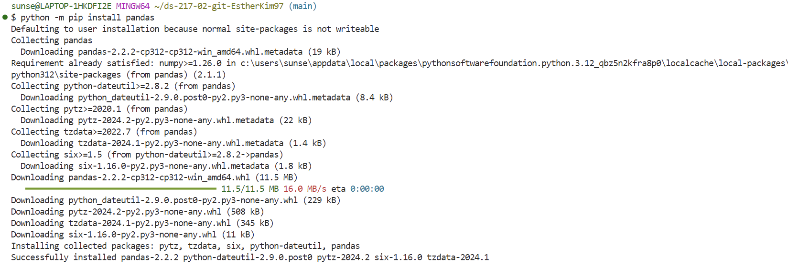

# Python Script for Assignment 1
If we list all the natural numbers below 10 that are multiples of 3 or 5, we get (3, 5, 6, 9). The sum of these multiples is 23. Find the sum of all the multiples of 3 or 5 below 1000.

sum = 0
for i in range(1000):
    if (i % 3 == 0) or (i % 5 == 0):
        sum = sum + i
print(sum)

# Link to official Python website
[Official Python website] (https://www.python.org)

# Screenshot of Pandas Installation

# Meme
